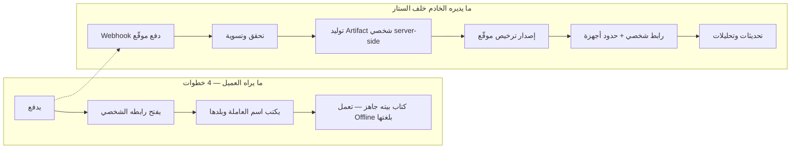

# 28) تصور المنتج: فاخر بصريًا، بسيط جدًا خطواتيًا (Premium-Simple Product Concept)

**تاريخ الإصدار:** أكتوبر 2026

---

## 1) مبدأ التصميم الأعلى [توصية]

> المنتج **كتاب** في إحساس العميل وتسويقه — لا «تطبيق» ولا «منصة» ولا «نظام». تقنيًا هو PWA خفيف، لكن لا تظهر أي كلمة تقنية في واجهة العميل. الفخار في الشكل (ورق فاخر، خطوط أنيقة، اسم البيت مطبوعًا على الغلاف) والبساطة في الخطوات.

## 2) الواجهة: 5 وجهات أساسية كحد أقصى [توصية]

| # | الوجهة | ما تقدمه | لمن |
|---|---|---|---|
| 1 | **غلاف بيتنا** | اسم البيت/العائلة، اسم العاملة بلغتها، زر واحد كبير «ابدئي» | الاثنان |
| 2 | **مهام اليوم** | بطاقات صوتية/مصورة بلغة العاملة، زر «تم» كبير | العاملة |
| 3 | **دليل البيت** | الأجهزة بالصورة، القواعد، معايير النظافة المصوّرة | العاملة |
| 4 | **نقولها لبعض** | تعليمات ثنائية الاتجاه: الأسرة تسجل صوتيًا → تسمعها بلغتها؛ والعاملة ترد وتسمع الأسرة الرد بالعربية | الاثنان |
| 5 | **الطوارئ** | لا تُقفل أبدًا: أرقام وإسعافات مصورة | الاثنان |

إدارة المحتوى (تعديل الذاكرة، إضافة مهمة) تكون في **وضع الأسرة** خلف قفل بسيط، ولا تحسب ضمن وجهات العاملة.

## 3) ثلاثة تصورات منتج بديلة — والقرار (J)

| التصور | الوصف | الإيجابيات | السلبيات |
|---|---|---|---|
| **(1) كتاب ذكي مستقل** | ملف واحد يُحمَّل (Web package) يعمل Offline كاملًا بعد التنزيل | لا خادم بعد البيع؛ إحساس «امتلاك كتاب» | لا تحديثات؛ الحماية أضعف (ملف قابل للنسخ والتداول)؛ التخصيص يتجمد لحظة التصدير |
| **(2) PWA مستضافة** | رابط شخصي + تفعيل أول، ثم Offline عبر Cache/IndexedDB | تحديثات مستمرة؛ ترخيص وتحكم أفضل؛ تحليلات استخدام؛ Hand-over سهل | يحتاج خادمًا دائمًا؛ أول تشغيل يتطلب اتصالًا |
| **(3) Hybrid** | PWA مستضافة أساسًا + تصدير نسخة Offline كميزة VIP | أفضل الاثنين نظريًا | ضعف مساحة البناء والاختبار تقريبًا؛ خطران أمنيان بدل واحد |

**القرار [توصية نهائية]:** **التصور (2) — PWA مستضافة** هي المنتج الأساسي، مع إبقاء (3) كترقية VIP لاحقة بعد إثبات الطلب. مبررات القرار: الترخيص والتخصيص والتحديث وHand-over كلها تفترض خادمًا حيًا؛ والسوق المستهدف يملك اتصالًا شبه دائم (98.4% عبر الجوال في السعودية [حقيقة موثقة — GASTAT](https://www.stats.gov.sa/documents/20117/2435267/ICT+Access+and+Usage+2025-EN.pdf/d91fc7dd-2f2e-ee1a-248c-c8f38102ef01?t=176760367464538)). التصور (1) مرفوض كأساس لأنه يحوّل المنتج إلى PDF محسّن قابل للنسخ بلا أي ردع.

## 4) K) الواجهة البسيطة فوق البنية الذكية

[توصية] كل رسالة تسويقية تعرض الوجه الأيسر فقط؛ الوجه الأيمن لا يُذكر إلا في صفحة «الأمان والخصوصية» لمن يسأل.
