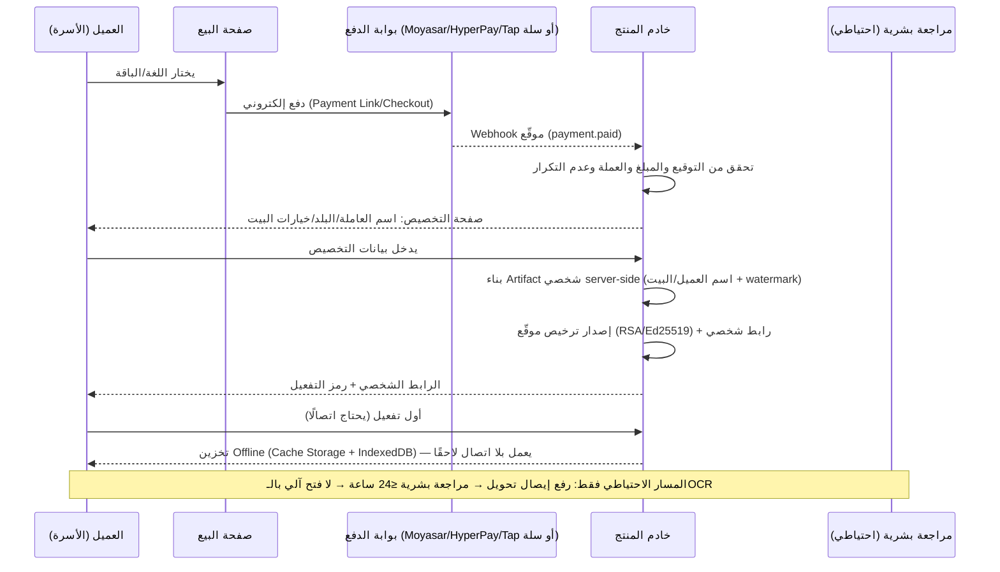

# 29) تدفق الشراء والتخصيص والتسليم الآلي الآمن (Purchase → Customization → Fulfillment)

**تاريخ الإصدار:** أكتوبر 2026

---

## D) التدفق المعتمد [توصية]

## قواعد ملزمة

1. **[توصية] الإيصال المصوّر ليس دليل دفع أبدًا.** صورة الإيصال قابلة للتزوير؛ التفعيل الآلي يتم حصرًا عبر **webhook موقّع** من بوابة الدفع المرخصة. رفع الإيصال مسار استثنائي للتحويل البنكي اليدوي، ويعلّق الطلب على **مراجعة بشرية** مع تطابق رقم العملية البنكي، ولا يُستخدم OCR وحده للفتح.
2. **[توصية] التوليد server-side بالكامل**: لا يصل العميل أي ملف قالب خام؛ يصله نسخة مبنية باسمه مع fingerprint خفي في المحتوى (ملف 31).
3. **[توصية] الرابط الشخصي** يحمل token غير قابل للتخمين، ويرتبط بالترخيص لا بالعميل المجهول؛ إعادة الإصدار عند «تغيير العاملة» تُبطل الرابط القديم وتنشئ جديدًا.
4. **[حقيقة موثقة]** سلة تدعم التجارة والمدفوعات والتطبيقات، ووثائق مساعدتها تشير لحماية PDF بروابط متجددة — لكنها **ليست DRM كاملًا** [Salla](https://salla.com/) / [مساعدة سلة](https://help.salla.sa/article/%D8%AD%D9%85%D8%A7%D9%8A%D8%A9-%D8%A7%D9%84%D8%AD%D9%82%D9%88%D9%82-%D8%A7%D9%84%D9%81%D9%83%D8%B1%D9%8A%D8%A9-%D9%84%D9%84%D9%85%D9%86%D8%AA%D8%AC-%D8%A7%D9%84%D8%B1%D9%82%D9%85%D9%8A-1/djhm5xfcrvl3e1ulrqg8nzts). لذلك: سلة = كاشير وواجهة بيع محتملة، والترخيص والتفعيل على بنيتنا (يتسق مع ملف 24).

## بيانات التخصيص المطلوبة من العميل (تُجمع بحد أدنى وفق PDPL — ملف 33)

| الحقل | إلزامي؟ | الاستخدام |
|---|---|---|
| اسم البيت/العائلة | نعم | الغلاف والتخصيص |
| اسم العاملة | نعم | الترحيب بلغتها |
| جنسية/لغة العاملة | نعم | اختيار حزمة اللغة والصوت |
| أجهزة البيت (اختيار من قائمة + صور اختيارية) | لا | دليل الأجهزة |
| قواعد البيت (≤7) | لا | «قواعد لا تُكسر» |
| بريد/جوال العميل | نعم | إيصال واستعادة الرابط |

[توصية] لا تُجمع أي بيانات عن العاملة نفسها (هوية، جواز، موقع) — ليست طرفًا قابضًا ولا مستخدمًا مُعرَّفًا (ملف 33).
