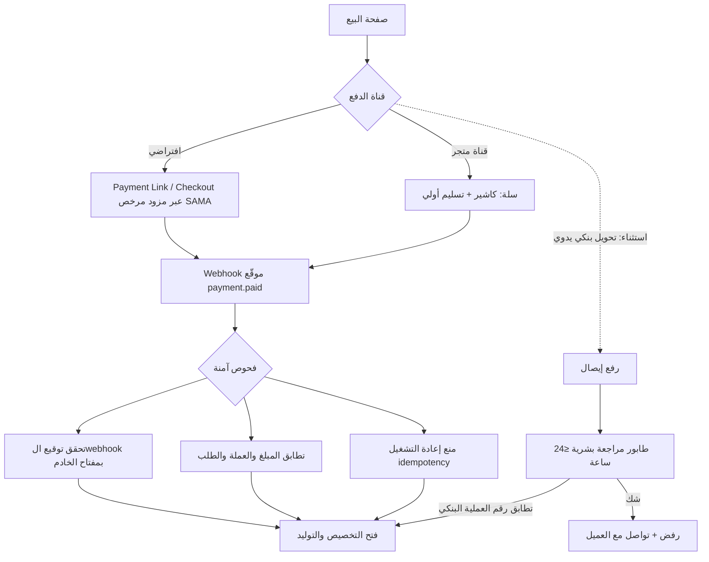

# 32) التحقق من الدفع ومكافحة الاحتيال (Payment Verification & Fraud)

**تاريخ الإصدار:** أكتوبر 2026

---

## 1) القاعدة الذهبية [توصية ملزمة]

**لا يُفتح المنتج آليًا بناءً على صورة إيصال.** الإيصال المصوّر قابل للتزوير بالكامل. الفتح الآلي الوحيد المقبول: **webhook موقّع** من بوابة دفع مرخصة تؤكد `payment.paid` بالمبلغ والعملة الصحيحين.

## 2) بوابات الدفع السعودية — وضع السوق [حقيقة موثقة ما لم يُوسم]

من مقارنة HyperPay المنشورة (مصدر طرف له مصلحة تجارية — تُقرأ أرقامه بحذر ويُتحقق منها تعاقديًا) [HyperPay](https://www.hyperpay.com/blog/best-payment-gateway-in-saudi-arabia/):

| المزود | الوضع الترخيصي (سجل SAMA) | نشر الأسعار؟ |
|---|---|---|
| HyperPay | Electronic Money Institution، رقم موحد 7016872546، صالح حتى 29/12/2029 | لا — تسعير لكل تاجر |
| Moyasar | Payment Institution (7010466964، حتى 13/01/2030) | لا — إحالة للمبيعات [Moyasar FAQ](https://moyasar.com/en/resources/faqs/) |
| Tap | Payment Institution (7002845464، حتى 04/09/2029) | لا — رابط التسعير السعودي يرجع 404 |
| PayTabs | — | جزئيًا: 49 ريالًا/شهر للتطبيق المستقل، mada 1%، بطاقات ائتمانية 2.25% + 1 ريال — **مع تنبيه منشور من PayTabs نفسها أن التسعير قيد الاختبار وقابل للتغيير [أسعار متغيرة — تُوسم]** |
| Telr | مرخص من المصرف المركزي الإماراتي | نعم: من 99 ريالًا/شهر + 3% + 1 ريال للبطاقات، mada بنسبة 1% — قبل ضريبة القيمة المضافة 15% **[أسعار متغيرة — تُوسم]** |
| Stripe | **لا يدرج السعودية ضمن الدول المدعومة للتجار** في صفحته الرسمية | غير قابل — خيار مرفوع |

- [حقيقة موثقة] بموجب تعميم SAMA رقم 46004436 (24 يوليو 2024): التاجر يجب أن يتأكد أن التسوية النهائية لأمواله تتم عبر جهة مرخصة من SAMA — نسأل أي مزود: «من الجهة المرخصة التي تسوّي أموالي بالاسم؟» قبل التوقيع.
- [استنتاج] نمط موحد عبر كل بطاقات الأسعار المنشورة: **mada أرخص بوضوح من البطاقات الدولية** (1% مقابل 2.25%–3%) — وجود mada في صفحة الدفع إلزامي للسوق السعودي.

## 3) البنية المعتمدة [توصية]

## 4) مكافحة الاحتيال — قائمة التهديدات

| الاحتيال | الضابط |
|---|---|
| إيصال مزوّر | لا فتح آلي بالإيصال إطلاقًا؛ مراجعة بشرية للتحويل اليدوي فقط |
| Webhook مزيّف | تحقق توقيع إلزامي؛ رفض أي event غير موقّع |
| إعادة استخدام payment_id | Idempotency keys؛ كل دفعة تفتح طلبًا واحدًا مرة واحدة |
| دفع ثم استرداد (chargeback) بعد التفعيل | الترخيص قابل للإبطال server-side؛ النسخة Offline تتوقف عند أول مزامنة (قيد معلن في ملف 31) |
| بطاقات مسروقة | نعتمد 3-D Secure وضوابط المزود المرخص؛ سؤال تعاقدي إلزامي عن رسوم الـchargeback وسياسة الاسترداد |
| حسابات وهمية لاستنزاف التوليد | Rate limiting + حد توليد لكل دفعة |

[توصية] الأسعار جميعها تُوسم «متغيرة» وتُثبت كتابيًا في الاتفاق، ويُسأل كل مزود عن أربعة بنود لا تظهر في صفحات الأسعار: رسوم الاسترداد، هل الرسم الثابت لكل محاولة أم لكل نجاح، رسوم الـchargeback، وشروط الخروج وترحيل الرموز [HyperPay](https://www.hyperpay.com/blog/best-payment-gateway-in-saudi-arabia/).
